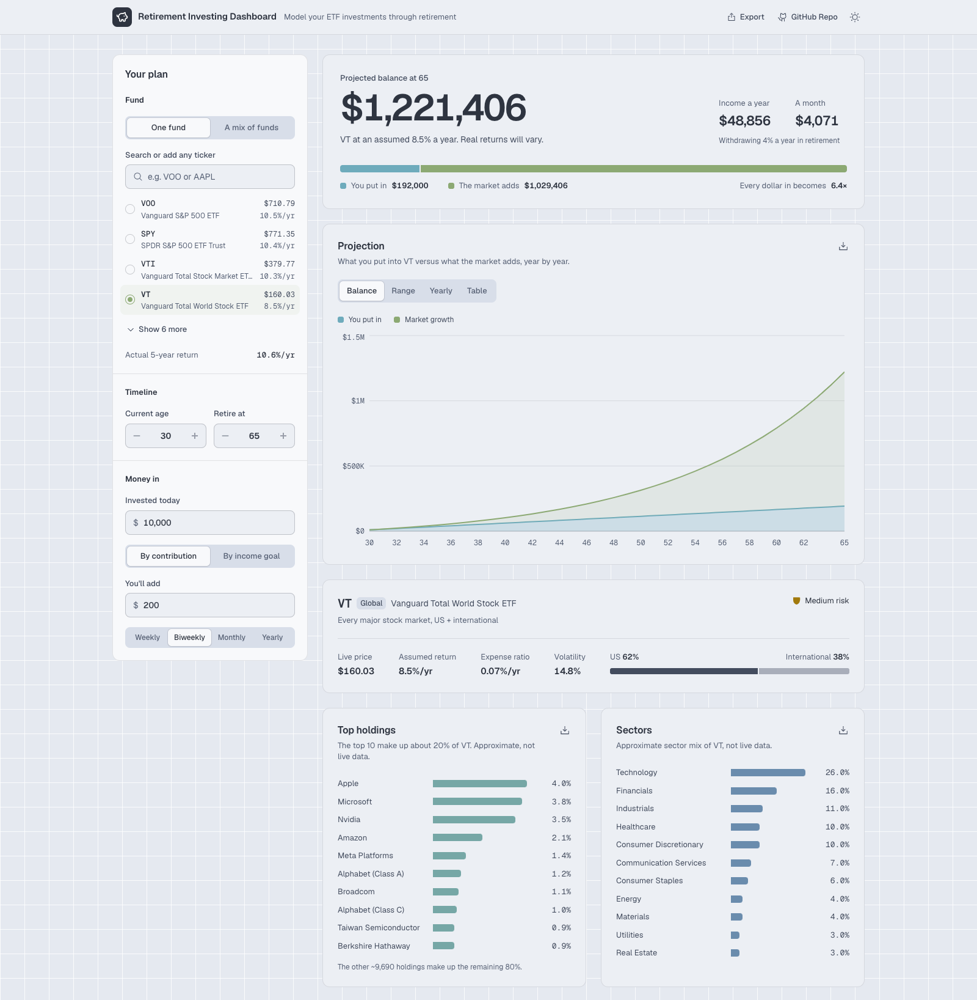

# Retirement Investing Dashboard

An interactive dashboard for projecting how ETF and stock investments could grow toward
retirement. Pick a preset fund, type in any ticker, or blend several funds into a portfolio.
Set your age, current savings, and contribution schedule, and the dashboard projects your
balance forward with charts covering growth, risk, holdings, sector exposure, and more. There
is also a goal mode that works backward: tell it the retirement income you want, and it solves
for the contribution you would need to get there.

<picture>
  <source media="(prefers-color-scheme: dark)" srcset="docs/screenshot.png">
  
</picture>

Everything runs in the browser using built in historical return assumptions by default. When
deployed on Netlify, or run locally with the Netlify CLI, the app also pulls live prices, plus a
real trailing five year return and volatility for any ticker you type in, through a small
serverless function.

## Features

- Choose from ten preset ETFs (VOO, SPY, VTI, VT, VXUS, QQQ, SCHD, BND, AGG, SPLV) or type in
  any custom ticker
- Blend multiple funds into a single portfolio with adjustable weights that always add up to
  100 percent
- Enter your current age, target age, current invested amount, and a contribution amount on a
  weekly, biweekly, monthly, or yearly schedule
- Switch to goal mode and enter a desired annual retirement income instead. The app solves for
  the contribution needed to reach it
- Five year return and volatility lookup for any ticker, when live data is available
- Live price for each fund, refreshed every five minutes, with a 12 month average price shown
  instead when a live quote isn't available
- One projection card with four views: the balance split into contributions and market growth,
  a lower to higher return range, a bar chart of yearly gains, and a full year by year table
- Risk versus return scatter plot, with a table view that lists each fund's volatility and risk
  tier
- Top ten holdings, sector weightings, and domestic versus international breakdowns, with
  automatic blending across a multi fund portfolio
- A comparison of your plan against every preset fund
- Estimated retirement income using the 4 percent safe withdrawal rule
- The headline projection and its supporting figures count up to their new value when you
  change an input
- CSV export on individual charts, a full multi sheet Excel workbook, and a one click PDF export
- Light and dark themes that follow the system setting, with a manual override

## Tech stack

- React 19, TypeScript, and Vite
- Tailwind CSS v4 for styling
- Recharts for all charts
- Framer Motion for numbers that count up when an input changes, and for the sliding
  segmented controls
- Geist and Geist Mono, self hosted through Fontsource
- Phosphor for icons
- ExcelJS for the multi sheet workbook export, loaded on demand so it does not add weight to
  the initial page load
- A single Netlify Function for the optional live data proxy
- oxlint for linting

## Project structure

```
.github/workflows/deploy-pages.yml  Builds and publishes the GitHub Pages mirror
.vscode/                     Tasks and Chrome debug configs
docs/screenshot*.png         The README screenshots, dark and light (not shipped with the site)
netlify/functions/finance.mts Serverless proxy for live prices, returns, and volatility
netlify.toml                 Netlify build, dev, and redirect settings
404.html                     Not-found page, built as a second Vite entry so its links follow `base`
vite.config.ts               Vite config (dev server is pinned to port 5183)
src/
  App.tsx                    Top level state, derived calculations, and page layout
  main.tsx                   React entry point
  index.css                  Design tokens (one light-dark() set), Tailwind theme mapping, and global styles
  components/
    Header.tsx               Logo and title, Export menu (print to PDF, Excel report), GitHub Repo link, theme menu
    SummaryHero.tsx          Projected balance, retirement income, and the contributions versus growth split
    MobileBalanceBar.tsx     Keeps the projected balance in view on phones while you edit the plan
    ControlsPanel.tsx        The "Your plan" sidebar: fund search, mix builder, ages, contributions, goal mode
    ProjectionCard.tsx       Tabs for the balance, range, and yearly charts plus the full table
    GrowthChart.tsx          Stacked contributions and market growth over time
    ScenarioChart.tsx        Expected path with a lower to higher return band
    YearlyGrowthBarChart.tsx Market growth added each year
    FundOverviewCard.tsx     The selected fund or mix: return, fees, volatility, US versus international
    HoldingsChart.tsx        Top ten holdings
    SectorChart.tsx          Sector weighting breakdown
    CompareChart.tsx         Your plan run through every preset fund, ranked
    RiskReturnChart.tsx      Scatter plot of volatility versus average return, with a table view
    RankedBars.tsx           Labeled horizontal bars shared by holdings, sectors, and the comparison
    Card.tsx, Segmented.tsx, Menu.tsx, ChartTooltip.tsx, AnimatedNumber.tsx, RiskBadge.tsx,
    DownloadCsvButton.tsx    Shared UI pieces
  data/
    etfs.ts                  Preset fund list and their assumed return, expense ratio, and risk
    fundComposition.ts       Static top holdings, sector, and geography data per fund
  lib/
    projection.ts            The compounding growth model and the goal mode reverse solver
    portfolio.ts             Blended return and volatility math, and mix rebalancing logic
    liveData.ts              Client for the live data function
    risk.ts                  Volatility to risk label bucketing
    excelExport.ts, download.ts   Export helpers
    chartTheme.ts            Shared axis, grid, and tick styling, round-number ticks, and the draw-in timing
    ui.ts                    Class strings for the shared button and field shapes
```

## Getting started

Requires Node.js 20.19 or newer, or 22.12 or newer. Vite 8 will not run on older versions.

```bash
npm install
npm run dev
```

This opens the app at `http://localhost:5183`. That alone gives you the full app with the built
in return assumptions. Live data is optional and the app works correctly without it.

## Available scripts

- `npm run dev`, starts the Vite dev server
- `npm run build`, type checks the project and builds a production bundle into `dist/`
- `npm run lint`, runs oxlint
- `npm run preview`, serves the production build locally to sanity check it before deploying

## VS Code

The `.vscode/` folder has task and debug configs for this project.

- Tasks (Terminal, then Run Task): `dev`, `netlify dev`, `build`, `lint`, and `preview`. `build`
  is the default build task, so Cmd+Shift+B runs it.
- Launch configs (Run and Debug): "Launch Chrome against dev server" starts the `dev` task and
  opens Chrome with breakpoints working in the TypeScript source. "Launch Chrome against Netlify
  dev (live data)" does the same through `netlify dev` on port 8888. "Attach to Chrome" connects
  to a Chrome window that was started with remote debugging on port 9222.
- The same three configs exist for Firefox. They need the "Debugger for Firefox" extension
  (`firefox-devtools.vscode-firefox-debug`), which `.vscode/extensions.json` recommends, so VS Code
  offers to install it the first time you open the project. "Attach to Firefox" expects Firefox to
  have been started with `--start-debugger-server 6000` and `devtools.debugger.remote-enabled` set
  to true.

## Live market data

`netlify/functions/finance.mts` proxies Yahoo Finance's chart endpoint so the browser can get a
real five year CAGR for any ticker without running into CORS restrictions or needing an API key.
It also computes an annualized volatility figure from the same price history, and returns the
latest price along with a 12 month average price.

The plan panel and the fund card show the live price and refresh it every five minutes. When
there's no live quote, they show a 12 month average instead, marked with "~" in the fund list.
That average comes from the function when it's reachable, and otherwise from the `avgPrice`
figures built into `src/data/etfs.ts`, which are dated in a comment there and worth refreshing
now and then.

This is an unofficial, undocumented endpoint. It can change or start rate limiting without
notice. That is an acceptable tradeoff for a personal project, since it needs no signup and no
API key that could leak from a public repository, but it should not be relied on for anything
that needs guarantees.

To test it locally before deploying, run the Netlify CLI:

```bash
npx netlify dev
```

This runs the Vite dev server and the function together on one origin at
`http://localhost:8888`, using the settings in `netlify.toml`. Without it, a plain `npm run dev`
still gives you the full app. It simply falls back to the built in historical averages, since
the `/.netlify/functions/*` route only exists in a Netlify environment.

## Deploying to Netlify

1. Push this repository to GitHub.
2. In Netlify, choose "Add a new site", then "Import an existing project", and pick the
   repository.
3. Netlify reads `netlify.toml` automatically. Build command is `npm run build`, the publish
   directory is `dist`, and the functions directory is `netlify/functions`. No environment
   variables are required.

## Deploying to GitHub Pages

Netlify stays the canonical deploy — it's the URL in the canonical tag, the sitemap, and the
social cards — but the site can also be mirrored to GitHub Pages by
`.github/workflows/deploy-pages.yml`, which builds on every push to `main` and on manual dispatch.

To turn it on, open the repository's Settings, then Pages, and set **Source** to **GitHub
Actions**. Nothing else needs configuring; there are no secrets to add.

Two things differ from the Netlify build, and the workflow handles both:

- **Base path.** A Pages project site is served from `https://<user>.github.io/<repo>/`, so the
  build runs with `BASE_PATH` set from the repository name and Vite prefixes every asset URL in
  the HTML with it. Builds without `BASE_PATH` keep the plain `/` root that Netlify serves from,
  so forks and renames work without editing anything.
- **Live market data.** Pages is static-only and can't run `netlify/functions/finance.mts`, so the
  build sets `VITE_FINANCE_ENDPOINT` to the Netlify deploy's copy of the function, which
  allow-lists `https://amishpr.github.io` for CORS. If you fork this, update that allow-list in
  `netlify/functions/finance.mts` and the endpoint in the workflow to match your own deploys — or
  drop both, in which case the mirror simply falls back to the built-in historical averages, the
  same way `npm run dev` does.

Because the canonical tag still points at the Netlify site, search engines fold the mirror into
that one rather than indexing it separately. `robots.txt` and `sitemap.xml` are likewise written
for the Netlify origin; a Pages project site serves them from under `/<repo>/`, where crawlers
ignore them anyway.

## Exporting

- **CSV.** Each chart card has a small download button that exports the rows behind that chart.
- **Excel.** The header button builds one workbook with a sheet each for the summary, growth
  projection, scenario range, yearly growth, risk versus return, top holdings, sector
  weightings, domestic versus international split, portfolio composition, and the fund
  comparison. ExcelJS is only downloaded when you click the button.
- **PDF.** The header button scrolls to the bottom of the page, waits two seconds so every chart
  finishes drawing, then opens the browser print dialog. Choose "Save as PDF" as the
  destination. The print styles force the light theme and a landscape layout, hide the Your Plan
  panel, and put each chart card on its own page.

## Theming

All colors live in `src/index.css` as CSS custom properties. Each one is a light and dark pair,
so the page follows the system theme or the one picked in the header menu. Components read the
variables, so changing a color is a one line edit. Printing always uses the light values,
whichever theme is active on screen.

Both themes are [Nord](https://www.nordtheme.com/docs/colors-and-palettes), and the charts use
Nord's own colors: Frost blue (nord8) for money you put in, Aurora green (nord14) for market
growth and your selected fund, and the other Frost blues (nord7 and nord9) for top holdings and
sectors. A losing year shows in red, the same color as the highest risk level, and yellow is kept
for the medium risk level only. The dark theme uses the exact Nord values. The light theme uses
the same colors one small step darker, so they stay soft but still show up against the light
cards. Keyboard focus rings use Nord's main UI blue.

## Performance

The projection math is cheap. All of the projections for one render take about 0.03 milliseconds,
so the work that matters is rendering. A few choices keep sliders and text fields responsive:

- Chart components are wrapped in `React.memo`, so a change only re-renders the charts whose
  data actually changed.
- `App` gives the inputs panel the live state and feeds everything else from `useDeferredValue`,
  so typing and dragging stay responsive while the charts catch up.
- Recharts animations are off, except for the first draw of the growth chart. A full animation
  restarting on every slider step made the page feel laggy.
- `Intl.NumberFormat` instances are created once and reused. Creating one costs about 100 times
  more than formatting with an existing one.

## How the projection works

The model lives in `src/lib/projection.ts` and is intentionally simple to reason about: it
simulates the plan one month at a time rather than relying on a single formula for the whole
span of years.

Whatever contribution schedule the user picks, weekly, biweekly, monthly, or yearly, is first
converted into a monthly equivalent amount. From there, each month follows the same two steps:
the contribution is added to the balance, and then the balance is grown by the monthly rate
implied by the assumed annual return. That monthly rate is derived from the annual rate using
`(1 + annualReturn) ** (1/12) - 1`, rather than simply dividing the annual return by twelve, so
that compounding over a full year lands exactly on the stated annual return. Running this same
simulation three times, once at the assumed return and once each a couple of points above and
below it, produces the conservative to optimistic scenario range shown on the chart.

Goal mode runs the same model in reverse. Instead of simulating forward from a contribution to
find an ending balance, it starts from a target balance, the desired retirement income divided
by the 4 percent safe withdrawal rate, and solves directly for the monthly contribution needed
to reach it. This uses the future value of an annuity due formula, the standard closed form
formula for a stream of equal payments added at the start of each period and then compounded,
rather than approximating the answer with a search or iteration loop. It was verified by feeding
the resulting contribution back into the forward simulation and confirming it lands on the exact
target balance.

A fuller explanation of the reasoning behind this approach, along with the portfolio blending
math and two real bugs the model went through during an audit, is in `WALKTHROUGH.md`.

## Disclaimer

Historical average returns, the scenario range, fund composition
data, and the retirement income estimate are all educational approximations. They are not
guarantees, predictions, or financial advice.
