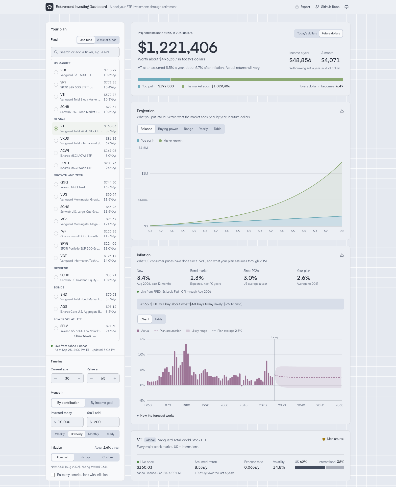

# Retirement Investing Dashboard

An interactive dashboard for projecting how ETF and stock investments could grow toward
retirement. Pick a preset fund, type in any ticker, or blend several funds into a portfolio.
Set your age, current savings, and contribution schedule, and the dashboard projects your
balance forward with charts covering growth, risk, holdings, sector exposure, and more. There
is also a goal mode that works backward: tell it the retirement income you want, in today's
dollars or future dollars, and it solves for the contribution you would need to get there. Every
figure opens in future dollars, what the account statement will say, and can be switched to
today's dollars, using a forecast of US inflation built from consumer price history and what the
bond market expects, so you can see what the money will actually buy.

<picture>
  <source media="(prefers-color-scheme: dark)" srcset="docs/screenshot.png">
  
</picture>

Everything runs in the browser using built in historical return assumptions by default. When
deployed on Netlify, or run locally with the Netlify CLI, the app also pulls live prices, plus a
real trailing five year return and volatility for any ticker you type in, and fresh inflation
data from FRED, through two small serverless functions.

## Features

- Start from the five most widely held index ETFs (VT, VOO, VTI, SPY, VXUS), or open "Show more"
  for all 19 presets, grouped in a scrolling list: US market (VOO, SPY, VTI, SCHB), global (VT,
  VXUS, ACWI, URTH), growth and tech (QQQ, VUG, SCHG, MGK, IWF, SPYG, VGT), dividend (SCHD), bonds
  (BND, AGG), and lower volatility (SPLV). Search covers every fund, or type in any custom ticker
- Blend multiple funds into a single portfolio with adjustable weights that always add up to
  100 percent
- Enter your current age, target age, current invested amount, and a contribution amount on a
  weekly, biweekly, monthly, or yearly schedule
- Switch to goal mode and enter a desired annual retirement income instead, counted in future
  dollars (the default) or today's dollars. The app solves for the contribution needed to reach it
- Show every figure in future dollars (the default) or today's dollars, and choose the inflation
  assumption: a forecast, the US average since 1926, or your own rate. Contributions can rise
  with inflation too
- Five year return and volatility lookup for any ticker, when live data is available
- Live price for each fund from Yahoo Finance, refreshed every five minutes, with a status line
  that says when prices were quoted and last updated. A 12 month average price is shown instead
  when a live quote isn't available, and the page keeps retrying in the background
- One projection card with five views: the balance split into contributions and market growth,
  buying power (future dollars against today's dollars, with a likely range), a lower to higher
  return range, a bar chart of yearly gains, and a full year by year table
- An inflation card with today's rate, the bond market's expectation, the long run average, and
  a chart of every year since 1960 running into the plan's forecast
- Risk versus return scatter plot, with a table view that lists each fund's volatility and risk
  tier
- Top ten holdings, sector weightings, and domestic versus international breakdowns, with
  automatic blending across a multi fund portfolio
- A comparison of your plan against every preset fund
- Estimated retirement income using an adjustable safe withdrawal rate, 4 percent by default
- The headline projection and its supporting figures count up to their new value when you
  change an input
- CSV export on individual charts, a full multi sheet Excel workbook, and a one click PDF export
- Light and dark themes that follow the system setting, with a manual override

## Tech stack

- React 19, TypeScript, and Vite
- Tailwind CSS v4 for styling
- Recharts for all charts
- Framer Motion for numbers that count up when an input changes, and for the sliding
  segmented controls
- Cabinet Grotesk for headings and Satoshi for everything else, from Fontshare, self hosted (see
  [Fonts](#fonts))
- Phosphor for icons
- ExcelJS for the multi sheet workbook export, loaded on demand so it does not add weight to
  the initial page load
- Two Netlify Functions for the optional live data: fund prices and inflation
- oxlint for linting

## Project structure

```
.github/workflows/deploy-pages.yml  Builds and publishes the GitHub Pages mirror
.vscode/                     Tasks and Chrome debug configs
docs/screenshot*.png         The README screenshots, dark and light (not shipped with the site)
netlify/functions/finance.mts Serverless proxy for live prices, returns, and volatility
netlify/functions/inflation.mts Serverless proxy for FRED's CPI history and market expectations
netlify/lib/                 Shared response helpers and the FRED parser (not deployed as functions)
scripts/fetch-fonts.mjs      Downloads the fonts before `dev` and `build` (see Fonts)
scripts/update-cpi.mjs       Regenerates the built-in inflation data from FRED
netlify.toml                 Netlify build, dev, and redirect settings
404.html                     Not-found page, built as a second Vite entry so its links follow `base`
vite.config.ts               Vite config (dev server is pinned to port 5183)
src/
  App.tsx                    Top level state, derived calculations, and page layout
  main.tsx                   React entry point
  index.css                  Design tokens (one light-dark() set), Tailwind theme mapping, and global styles
  components/
    Header.tsx               Logo and title, Export menu (print to PDF, Excel report), GitHub Repo link, theme menu
    SummaryHero.tsx          Projected balance, retirement income, and the contributions versus growth split
    MobileBalanceBar.tsx     Keeps the projected balance in view on phones while you edit the plan
    ControlsPanel.tsx        The "Your plan" sidebar: fund search, mix builder, ages, contributions, goal mode
    ProjectionCard.tsx       Tabs for the balance, buying power, range, and yearly charts plus the full table
    GrowthChart.tsx          Stacked contributions and market growth over time
    BuyingPowerChart.tsx     Future dollars against today's dollars, with the likely range
    InflationCard.tsx        Inflation stats, the history and forecast chart, and its table
    InflationChart.tsx       Yearly inflation since 1960 running into the plan's forecast
    DataSource.tsx           The live prices status line and its status dot
    DeferredCard.tsx         Holds a lower card's place with a skeleton until it's drawn
    detailCards.ts           The cards below the main chart, loaded as one chunk after the first view
    ScenarioChart.tsx        Expected path with a lower to higher return band
    YearlyGrowthBarChart.tsx Market growth added each year
    FundOverviewCard.tsx     The selected fund or mix: return, fees, volatility, US versus international
    HoldingsChart.tsx        Top ten holdings
    SectorChart.tsx          Sector weighting breakdown
    CompareChart.tsx         Your plan run through every preset fund, ranked
    RiskReturnChart.tsx      Scatter plot of volatility versus average return, with a table view
    RankedBars.tsx           Labeled horizontal bars shared by holdings, sectors, and the comparison
    Card.tsx, Segmented.tsx, Menu.tsx, ChartTooltip.tsx, AnimatedNumber.tsx, RiskBadge.tsx,
    DownloadCsvButton.tsx    Shared UI pieces
  data/
    etfs.ts                  Preset fund list and their assumed return, expense ratio, and risk
    fundComposition.ts       Top holdings, sectors, and geography per fund (Sep 2026 snapshot)
    cpiHistory.ts            Built-in inflation data, generated by scripts/update-cpi.mjs
  lib/
    projection.ts            The compounding growth model, today's-dollar figures, and the goal mode solver
    inflation.ts             The inflation forecast model (tested with `npm test`)
    portfolio.ts             Blended return and volatility math, and mix rebalancing logic
    liveData.ts              Client for the live data functions
    useLiveQuotes.ts         Live quotes in stages (core five, then the rest), the refresh timer, and offline retries
    coreQuotes.ts            The core five tickers and the quote URL helper, shared with vite.config.ts
    risk.ts                  Volatility to risk label bucketing
    excelExport.ts, download.ts   Export helpers
    chartTheme.ts            Shared axis, grid, and tick styling, round-number ticks, and the draw-in timing
    ui.ts                    Class strings for the shared button and field shapes
```

## Getting started

Requires Node.js 20.19 or newer, or 22.12 or newer. Vite 8 will not run on older versions.

```bash
npm install
npm run dev
```

This opens the app at `http://localhost:5183`. That alone gives you the full app with the built
in return assumptions. Live data is optional and the app works correctly without it.

## Available scripts

- `npm run dev`, starts the Vite dev server
- `npm run build`, type checks the project and builds a production bundle into `dist/`
- `npm run lint`, runs oxlint
- `npm test`, runs the projection and inflation model tests with Node's built in test runner
- `node scripts/update-cpi.mjs`, refreshes the built-in inflation data from FRED

`dev` and `build` first run `scripts/fetch-fonts.mjs`, which downloads the two fonts once.
- `npm run preview`, serves the production build locally to sanity check it before deploying

## VS Code

The `.vscode/` folder has task and debug configs for this project.

- Tasks (Terminal, then Run Task): `dev`, `netlify dev`, `build`, `lint`, and `preview`. `build`
  is the default build task, so Cmd+Shift+B runs it.
- Launch configs (Run and Debug): "Launch Chrome against dev server" starts the `dev` task and
  opens Chrome with breakpoints working in the TypeScript source. "Launch Chrome against Netlify
  dev (live data)" does the same through `netlify dev` on port 8888. "Attach to Chrome" connects
  to a Chrome window that was started with remote debugging on port 9222.
- The same three configs exist for Firefox. They need the "Debugger for Firefox" extension
  (`firefox-devtools.vscode-firefox-debug`), which `.vscode/extensions.json` recommends, so VS Code
  offers to install it the first time you open the project. "Attach to Firefox" expects Firefox to
  have been started with `--start-debugger-server 6000` and `devtools.debugger.remote-enabled` set
  to true.

## Live market data

`netlify/functions/finance.mts` proxies Yahoo Finance's chart endpoint so the browser can get a
real five year CAGR for any ticker without running into CORS restrictions or needing an API key.
It also computes an annualized volatility figure from the same price history, and returns the
latest price along with a 12 month average price.

The plan panel and the fund card show the live price and refresh it every five minutes. When
there's no live quote, they show a 12 month average instead, marked with "~" in the fund list.
While a fund's first quote is still on its way, a small placeholder bar holds the spot instead.
That average comes from the function when it's reachable, and otherwise from the `avgPrice`
figures built into `src/data/etfs.ts`, which are dated in a comment there and worth refreshing
now and then.

A status line under the fund list says where prices stand: "Live from Yahoo Finance" with the
time the quotes are from and when they were last updated, "Checking Yahoo Finance" while the
first request is out, or "Live prices unavailable" when the app is showing its built-in
averages.

Quotes arrive in stages, so the first view isn't waiting on all 19:

1. The five core funds (VT, VOO, VTI, SPY, VXUS). `index.html` preloads this request, so it goes
   out while the page's JavaScript is still downloading.
2. The other 14 presets, once the cards below the main chart are drawn and the browser is idle.
   Opening "Show more" asks for them right away instead.
3. A ticker you add, on its own, as soon as you add it.

The page keeps them current on its own:

- Everything refreshes every five minutes while the tab is visible, and right away when you come
  back to a tab that missed its turn.
- If the first answer is a cached copy more than five minutes old, it's shown right away and then
  replaced by a fresh one.
- While Yahoo can't be reached, the page tries again after 30 seconds, 1 minute, and 2 minutes,
  then every five minutes, and at once when the browser comes back online.

Refreshes add the current five minute window to the URL, so they get past the CDN's cached copy
while every visitor in the same window still shares one response.

This is an unofficial, undocumented endpoint. It can change or start rate limiting without
notice. That is an acceptable tradeoff for a personal project, since it needs no signup and no
API key that could leak from a public repository, but it should not be relied on for anything
that needs guarantees. The free keyed alternatives fit worse: refreshing 19 or more symbols every
five minutes is past what Alpha Vantage, Twelve Data, Tiingo, or Finnhub allow for free, and
Stooq now puts its downloads behind a browser check. To soften the risk, the function:

- asks Yahoo for at most five symbols at a time, since bursts of 19 drew rate limit errors in
  testing
- retries a rate limited or failed request once on Yahoo's second host
- lets Netlify's CDN serve the last good response for up to an hour while it retries, and answers
  with an uncached error when every symbol fails, so an outage is never cached
- keeps its plain, self identifying user agent, which Yahoo answered reliably while it rate
  limited requests that claimed to be a desktop browser

To test it locally before deploying, run the Netlify CLI:

```bash
npx netlify dev
```

This runs the Vite dev server and the function together on one origin at
`http://localhost:8888`, using the settings in `netlify.toml`. Without it, a plain `npm run dev`
still gives you the full app. It simply falls back to the built in historical averages, since
the `/.netlify/functions/*` route only exists in a Netlify environment.

## Inflation data

`netlify/functions/inflation.mts` reads three public CSVs from FRED, the St. Louis Fed's data
service, and trims them to a few KB of JSON: CPI-U (`CPIAUCNS`, monthly since 1913), the 10 year
breakeven (`T10YIE`), and the 5 year, 5 year forward inflation expectation (`T5YIFR`). FRED needs
no API key but sends no CORS headers, which is why the browser goes through the function. The
response is cached for six hours.

The app starts from a built-in copy, `src/data/cpiHistory.ts`, and swaps in the live data when it
arrives, so plain `npm run dev`, the GitHub Pages mirror before the request returns, and a FRED
outage all still work. Refresh the copy after a CPI release with `node scripts/update-cpi.mjs`,
which uses the same parser as the function.

BLS published no October 2025 CPI because of the government shutdown. The parser skips blank
values instead of reading them as zero, and it averages a year only when at least 11 months are
there. [How the projection works](#how-the-projection-works) covers the forecast itself.

## Checking the data

On September 27, 2026, every figure the app ships with was checked against a second, independent
source:

- **CPI:** every annual average from 1926 to 2025 matches the BLS public API to within 0.001 index
  points, and so does the latest reading (August 2026, 334.980, up 3.4 percent from a year
  earlier, as the September 11 BLS release says). The 2025 average of 321.943 uses the 11 months
  BLS published, matching other published tables.
- **Bond market:** the 10 year breakeven of 2.34 percent equals Treasury's own 10 year nominal
  yield (5.17 percent) minus its 10 year real yield (2.83 percent) that day, and the 5 year
  numbers give the same 2.34 percent for the forward rate.
- **Fund prices:** the built-in 12 month averages match Yahoo's daily closes. VUG, MGK, and VGT
  split on April 21, 2026, and IWF on April 29, which Vanguard and iShares both confirm, so their
  prices look low next to older quotes.
- **Fees and holdings:** two expense ratios were out of date: VT is now 0.06 percent and QQQ 0.18
  percent (it became an open-end fund in December 2025). The holdings and sectors for the original
  ten funds were refreshed, and the bond fund mix matches the issuers' June 2026 fact sheets.

The inflation forecast sits inside the range of professional forecasts, a little high for the
next decade because it starts from today's 3.4 percent and eases down slowly:

| Source (September 2026) | Next 10 years | Next 30 years |
| --- | --- | --- |
| This app's forecast | 2.8% | 2.6% |
| Cleveland Fed expected inflation | 2.6% | 2.6% |
| Philadelphia Fed Survey of Professional Forecasters (CPI) | 2.3% | |
| Bond market, 10 year breakeven | 2.3% | |
| Social Security Trustees, long run (CPI-W) | | 2.4% |

Over the default 35 years, the forecast's 2.62 percent average means $100 at 65 buys about what
$40 buys today. At the 2.3 to 2.4 percent the surveys expect, it would buy $44 to $45. So the
today's dollars figures lean slightly cautious, well inside the likely range the app shows ($25 to
$66).

## Deploying to Netlify

1. Push this repository to GitHub.
2. In Netlify, choose "Add a new site", then "Import an existing project", and pick the
   repository.
3. Netlify reads `netlify.toml` automatically. Build command is `npm run build`, the publish
   directory is `dist`, and the functions directory is `netlify/functions`. No environment
   variables are required.

## Deploying to GitHub Pages

Netlify stays the canonical deploy — it's the URL in the canonical tag, the sitemap, and the
social cards — but the site can also be mirrored to GitHub Pages by
`.github/workflows/deploy-pages.yml`, which builds on every push to `main` and on manual dispatch.

To turn it on, open the repository's Settings, then Pages, and set **Source** to **GitHub
Actions**. Nothing else needs configuring; there are no secrets to add.

Two things differ from the Netlify build, and the workflow handles both:

- **Base path.** A Pages project site is served from `https://<user>.github.io/<repo>/`, so the
  build runs with `BASE_PATH` set from the repository name and Vite prefixes every asset URL in
  the HTML with it. Builds without `BASE_PATH` keep the plain `/` root that Netlify serves from,
  so forks and renames work without editing anything.
- **Live market and inflation data.** Pages is static-only and can't run `netlify/functions/`, so
  the build sets `VITE_FINANCE_ENDPOINT` and `VITE_INFLATION_ENDPOINT` to the Netlify deploy's
  copies of the functions, which allow-list `https://amishpr.github.io` for CORS. If you fork this,
  update that allow-list in `netlify/lib/http.mts` and the endpoints in the workflow to match your
  own deploys — or drop them, in which case the mirror simply falls back to the built-in averages
  and CPI history, the same way `npm run dev` does.

Because the canonical tag still points at the Netlify site, search engines fold the mirror into
that one rather than indexing it separately. `robots.txt` and `sitemap.xml` are likewise written
for the Netlify origin; a Pages project site serves them from under `/<repo>/`, where crawlers
ignore them anyway.

## Exporting

- **CSV.** Each chart card has a small download button that exports the rows behind that chart.
- **Excel.** The header button builds one workbook with a sheet each for the summary, growth
  projection, scenario range, yearly growth, risk versus return, top holdings, sector
  weightings, domestic versus international split, portfolio composition, the fund comparison,
  and inflation. The projection sheets carry both future dollars and today's dollars, whichever
  the page is showing. ExcelJS is only downloaded when you click the button.
- **PDF.** The header button scrolls to the bottom of the page, waits two seconds so every chart
  finishes drawing, then opens the browser print dialog. Choose "Save as PDF" as the
  destination. The print styles force the light theme and a landscape layout, hide the Your Plan
  panel, and put each chart card on its own page.

## Theming

All colors live in `src/index.css` as CSS custom properties. Each one is a light and dark pair,
so the page follows the system theme or the one picked in the header menu. Components read the
variables, so changing a color is a one line edit. Printing always uses the light values,
whichever theme is active on screen.

Both themes are [Nord](https://www.nordtheme.com/docs/colors-and-palettes), and the charts use
Nord's own colors: Frost blue (nord8) for money you put in, Aurora green (nord14) for market
growth and your selected fund, and the other Frost blues (nord7 and nord9) for top holdings and
sectors, and Aurora purple (nord15) for inflation. A losing year shows in red, the same color as the highest risk level, and yellow is kept
for the medium risk level only. The dark theme uses the exact Nord values. The light theme uses
the same colors one small step darker, so they stay soft but still show up against the light
cards. Keyboard focus rings use Nord's main UI blue.

## Fonts

Headings use Cabinet Grotesk and everything else, numbers included, uses Satoshi. Satoshi has
tabular figures, so digits line up in columns and don't jitter while a number counts up; Cabinet
Grotesk doesn't, so it's kept to headings. Both are variable fonts from
[Fontshare](https://www.fontshare.com).

They're under the ITF Free Font License, which allows self hosting for your own site but not
publishing the font files in a public repository. So they aren't committed: `src/assets/fonts/`
is gitignored, and `scripts/fetch-fonts.mjs` downloads them before `npm run dev` and
`npm run build`, locally, on Netlify, and in the Pages workflow alike. Vite then fingerprints them
into `/assets`. If the download fails, the build still succeeds and the page uses the system font
stack. Don't commit the font files.

## Performance

The projection math is cheap. All of the projections for one render take about 0.03 milliseconds,
so the work that matters is rendering. A few choices keep sliders and text fields responsive:

- Chart components are wrapped in `React.memo`, so a change only re-renders the charts whose
  data actually changed.
- `App` gives the inputs panel the live state and feeds everything else from `useDeferredValue`,
  so typing and dragging stay responsive while the charts catch up.
- Recharts animations are off, except for the first draw of the growth chart. A full animation
  restarting on every slider step made the page feel laggy.
- `Intl.NumberFormat` instances are created once and reused. Creating one costs about 100 times
  more than formatting with an existing one.

The first load is built around the first view: the balance, the plan panel, and the main chart.

- The cards below the main chart load as a separate chunk and mount one at a time when the
  browser is idle. Until then, skeletons the same size as the real cards hold their space, so
  nothing shifts. Scrolling toward one, or printing, mounts it right away.
- `vite.config.ts` preloads both fonts, the core five quotes, and the inflation data from
  `index.html`. Without the font preload, the fonts were only requested after the first layout,
  which cost a second full layout and a visible font swap.
- React, the charting library, and framer-motion are split into their own files, so a deploy that
  only changes the app leaves them cached.

Measured with a production build at 1440×900, with the CPU slowed 4x and a 9 Mbps connection:

| | Before | After |
| --- | --- | --- |
| First contentful paint | 2.16 s | 1.42 s |
| Main chart drawn | 3.41 s | 2.15 s |
| First five prices live | 5.27 s | 2.38 s |
| Total blocking time | 4.39 s | 2.92 s |
| Layout shift during load | 0.028 | 0.0002 |

## How the projection works

The model lives in `src/lib/projection.ts` and is intentionally simple to reason about: it
simulates the plan one month at a time rather than relying on a single formula for the whole
span of years.

Whatever contribution schedule the user picks, weekly, biweekly, monthly, or yearly, is first
converted into a monthly equivalent amount. From there, each month follows the same two steps:
the contribution is added to the balance, and then the balance is grown by the monthly rate
implied by the assumed annual return. That monthly rate is derived from the annual rate using
`(1 + annualReturn) ** (1/12) - 1`, rather than simply dividing the annual return by twelve, so
that compounding over a full year lands exactly on the stated annual return. Running this same
simulation three times, once at the assumed return and once each a couple of points above and
below it, produces the conservative to optimistic scenario range shown on the chart.

Inflation runs alongside. Prices rise through each year at that year's inflation rate, and every
balance and deposit is also tracked in today's dollars: each deposit counts at what it was worth
when it went in, so "growth after inflation" is what the plan earns beyond rising prices. The
yearly rates come from `src/lib/inflation.ts`. The forecast starts at the latest 12 month CPI
change and each year closes about a quarter of the gap to a long run anchor, halfway between the
bond market's 5 year, 5 year forward expectation and the last 40 years of history. That decay
rate, and the 10 to 90 percent range around it, come from fitting a first order autoregressive
model to US inflation since 1950.

Goal mode runs the same model in reverse. The income you want can be counted in future dollars,
which is already what the first year of retirement pays, or in today's dollars, which are first
scaled up to prices at retirement. Either way it's then turned into a target balance with the plan's withdrawal rate, 4 percent
by default and adjustable in the plan panel. The ending balance is linear in the contribution: it's what the starting
amount grows to, plus the contribution times what one dollar a month grows to. So two runs of the
same simulation give the exact contribution, even when contributions rise with inflation and the
inflation rate changes from year to year, which the closed form annuity formula used before
couldn't handle. The tests check that the answer lands on the target balance.

A fuller explanation of the reasoning behind this approach, along with the portfolio blending
math and two real bugs the model went through during an audit, is in `WALKTHROUGH.md`.

## Disclaimer

Historical average returns, the scenario range, the inflation forecast, fund composition data,
and the retirement income estimate are all educational approximations. They are not
guarantees, predictions, or financial advice.
